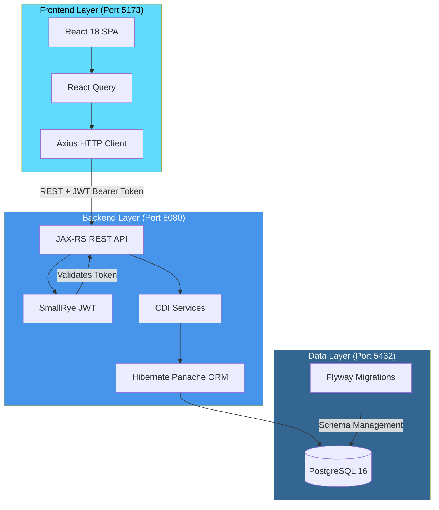
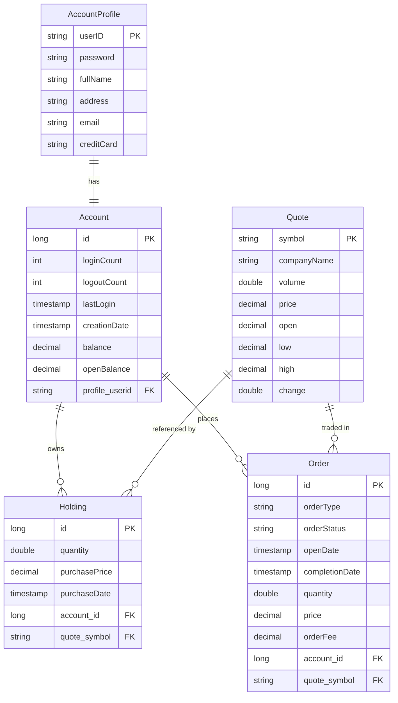

# DayTrader Modernized Architecture

## Overview

DayTrader is a stock trading application that has been modernized from a traditional Java EE (WebSphere) architecture to a modern 3-tier architecture using contemporary frameworks and cloud-native patterns.

The architecture follows a clean separation of concerns:

1. **Presentation Layer** - React-based Single Page Application (SPA)
2. **Business Logic Layer** - Quarkus-based REST API backend
3. **Data Layer** - PostgreSQL relational database with Flyway migrations

## Architecture Diagram



### Authentication Flow

```
┌──────────────┐     ┌─────────────────┐     ┌──────────────┐
│   React UI   │     │  Quarkus API    │     │  PostgreSQL  │
└──────┬───────┘     └────────┬────────┘     └──────┬───────┘
       │                      │                     │
       │  POST /api/auth/login                      │
       │  {userID, password}  │                     │
       │─────────────────────>│                     │
       │                      │   Validate User     │
       │                      │────────────────────>│
       │                      │   User Data         │
       │                      │<────────────────────│
       │                      │                     │
       │   {token, userID}    │  Generate JWT       │
       │<─────────────────────│  (RSA Signed)       │
       │                      │                     │
       │  Store token in      │                     │
       │  localStorage        │                     │
       │                      │                     │
       │  GET /api/account    │                     │
       │  Authorization:      │                     │
       │  Bearer <token>      │                     │
       │─────────────────────>│                     │
       │                      │  Verify JWT         │
       │                      │  Extract userID     │
       │                      │────────────────────>│
       │   Account Data       │                     │
       │<─────────────────────│<────────────────────│
       └──────────────────────┴─────────────────────┘
```

## Component Details

### Frontend Layer

| Technology | Version | Purpose |
|------------|---------|---------|
| React | 19.x | UI component library |
| TypeScript | 5.9 | Type-safe JavaScript |
| Vite | 7.x | Build tool and dev server |
| TailwindCSS | 4.x | Utility-first CSS framework |
| React Query | 5.x | Server state management |
| Axios | 1.x | HTTP client with interceptors |
| React Router | 7.x | Client-side routing |

**Key Features:**
- SPA architecture with client-side routing
- JWT token stored in localStorage
- Axios interceptors for automatic token attachment
- React Query for caching and synchronization
- Responsive design with TailwindCSS

### Backend Layer

| Technology | Version | Purpose |
|------------|---------|---------|
| Quarkus | 3.30.x | Supersonic Java framework |
| Java | 21 | Runtime with virtual threads |
| JAX-RS | 3.x | REST API specification |
| CDI | 4.x | Dependency injection |
| Hibernate Panache | - | Active Record ORM pattern |
| SmallRye JWT | - | MicroProfile JWT authentication |
| SmallRye OpenAPI | - | OpenAPI/Swagger documentation |
| Hibernate Validator | - | Bean validation |

**REST API Endpoints:**
- `/api/auth/*` - Authentication (login, register, logout)
- `/api/account/*` - Account management
- `/api/trade/*` - Trading operations (buy, sell)
- `/api/market/*` - Market data and quotes
- `/api/holdings/*` - Portfolio holdings
- `/api/orders/*` - Order history

### Data Layer

| Technology | Version | Purpose |
|------------|---------|---------|
| PostgreSQL | 16 | Relational database |
| Flyway | - | Database migrations |
| Quarkus Dev Services | - | Auto-provisioned dev database |

**Database Configuration:**
- Development: Auto-provisioned via Quarkus Dev Services
- Production: External PostgreSQL with environment variables

## Domain Model

The application manages five core entities representing a stock trading system:



### Entity Descriptions

| Entity | Description | Key Relationships |
|--------|-------------|-------------------|
| **Account** | User's trading account with balance tracking | One-to-one with AccountProfile, one-to-many with Holdings and Orders |
| **AccountProfile** | User credentials and personal information | Primary key is userID (login name) |
| **Holding** | Stock positions owned by an account | Links Account to Quote with quantity and purchase price |
| **Order** | Buy/sell order records | Tracks order type, status, and execution details |
| **Quote** | Stock quote with current market data | Referenced by Holdings and Orders via symbol |

## Security Architecture

The application implements stateless JWT-based authentication using SmallRye JWT (MicroProfile JWT).

### JWT Configuration

```properties
# Token signing and verification
mp.jwt.verify.publickey.location=publicKey.pem
smallrye.jwt.sign.key.location=privateKey.pem

# Token claims
mp.jwt.verify.issuer=https://daytrader.example.com
mp.jwt.verify.audiences=daytrader-api

# Token lifetime
daytrader.jwt.token.expiration=3600  # 1 hour
mp.jwt.verify.clock.skew=60          # 60 seconds tolerance
```

### Security Flow

1. **Login Request**: User submits credentials to `/api/auth/login`
2. **Credential Validation**: AuthService validates against database
3. **Token Generation**: JWTService generates RSA-signed token with:
   - Subject: userID
   - Groups: ["user"] (role-based access)
   - Expiration: 1 hour from issue
4. **Token Storage**: Frontend stores token in localStorage
5. **Authenticated Requests**: Axios interceptor attaches `Authorization: Bearer <token>`
6. **Token Verification**: SmallRye JWT validates signature and claims
7. **Role-Based Access**: `@RolesAllowed("user")` protects endpoints

### Protected vs Public Endpoints

| Endpoint | Access | Description |
|----------|--------|-------------|
| `/api/auth/login` | Public | User authentication |
| `/api/auth/register` | Public | New user registration |
| `/api/account/*` | `@RolesAllowed("user")` | Account management |
| `/api/trade/*` | `@RolesAllowed("user")` | Trading operations |
| `/api/market/*` | `@RolesAllowed("user")` | Market data |

## Technology Decisions

### Why Quarkus?

| Benefit | Description |
|---------|-------------|
| **Fast Startup** | Sub-second startup times ideal for cloud-native deployments |
| **Low Memory** | Optimized memory footprint for containerized environments |
| **Developer Experience** | Live reload, dev services, unified configuration |
| **Standards-Based** | MicroProfile and Jakarta EE standards for portability |
| **Native Compilation** | Optional GraalVM native image support |
| **Kubernetes Ready** | Built-in health checks, metrics, and container support |

### Why React?

| Benefit | Description |
|---------|-------------|
| **Component Model** | Reusable UI components with clear composition |
| **Ecosystem** | Rich ecosystem of libraries (React Query, Router) |
| **TypeScript Support** | Excellent TypeScript integration for type safety |
| **Performance** | Virtual DOM and efficient reconciliation |
| **Developer Tools** | React DevTools for debugging and profiling |

### Why PostgreSQL?

| Benefit | Description |
|---------|-------------|
| **Reliability** | ACID compliance and mature transaction support |
| **Performance** | Efficient query planning and indexing |
| **Standards** | Full SQL compliance with extensions |
| **Tooling** | Rich ecosystem of management and monitoring tools |
| **Cloud Support** | Available as managed service on all major clouds |

---

*This architecture modernizes the original WebSphere/Java EE DayTrader application while maintaining its core trading functionality.*

