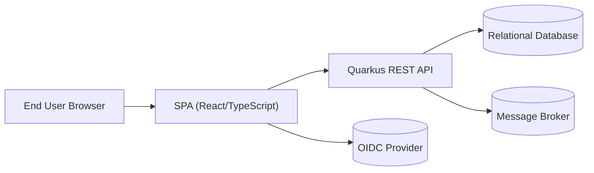
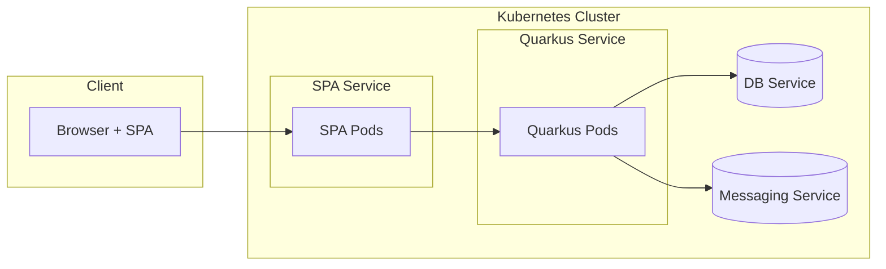
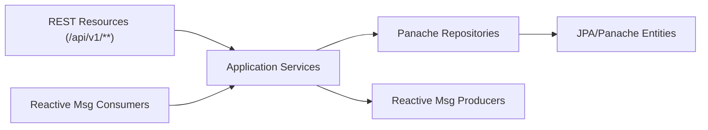

# DayTrader – Target Cloud-Native Architecture

## 1. Architecture Overview
- The target architecture separates the UI (SPA) from the backend (Quarkus REST API) and shared infrastructure services.
- The backend exposes REST/JSON APIs plus streaming endpoints; the SPA consumes them via HTTPS and real-time channels.
- The core domain (accounts, profiles, holdings, orders, quotes, market summary) is preserved, while the implementation is modernized.
- The system is containerized, horizontally scalable, and prepared for cloud deployment with externalized configuration and observability.

## 2. Backend Architecture (Quarkus)

### 2.1 Technology Stack
- **Runtime**: Quarkus (JVM mode initially, with optional native image for startup/footprint optimization).
- **REST**: RESTEasy Reactive for non-blocking HTTP endpoints.
- **Persistence**: Hibernate ORM with Panache entities and repositories (falling back to standard JPA where Panache is not a fit).
- **Dependency Injection**: CDI annotations (`@ApplicationScoped`, `@RequestScoped`, `@Singleton`) replace EJB session beans.
- **Messaging**: SmallRye Reactive Messaging for asynchronous order processing and market data updates.
- **Security**: Quarkus OIDC & JWT security, enforcing roles such as `user` and `admin` on endpoints.
- **Configuration & Observability**: Quarkus Config, Micrometer/SmallRye Metrics, OpenTelemetry tracing, structured logging.

### 2.2 Service and Layer Structure
- A single Quarkus application for this phase, logically separated into modules/packages:
  - **API layer**: REST resources under `/api/**` containing HTTP-specific concerns, validation, and response shaping.
  - **Application/service layer**: Use-case oriented services encapsulating business workflows (login, register, buy/sell, portfolio, market summary).
  - **Domain model**: JPA/Panache entities reflecting the 5 core tables (`AccountDataBean`, `AccountProfileDataBean`, `HoldingDataBean`, `OrderDataBean`, `QuoteDataBean`).
  - **Persistence/repositories**: Panache repositories or entity methods encapsulating queries, pagination, and transactional boundaries.
  - **Messaging components**: Reactive messaging channels and processors for order events and market data.
- EJBs are replaced as follows:
  - Stateless session beans → CDI-scoped services (`@ApplicationScoped` / `@RequestScoped`).
  - MDBs → Reactive Messaging consumers subscribed to broker topics/queues.
  - Singleton EJBs → `@Singleton` beans with explicit concurrency and scheduling.

### 2.3 REST API Design
- All APIs are versioned under `/api/v1/**` to allow future evolution.
- Key resources and responsibilities:
  - **`/api/v1/auth`**
    - `POST /login`: Authenticate user, return JWT access token (and optional refresh token).
    - `POST /logout`: Invalidate refresh token / server-side sessions if used.
  - **`/api/v1/accounts`**
    - `POST /`: Register new account (profile + initial account data).
    - `GET /{accountId}`: Retrieve account summary.
    - `GET /{accountId}/profile`: Retrieve profile details.
    - `PUT /{accountId}/profile`: Update profile details.
  - **`/api/v1/holdings`**
    - `GET /account/{accountId}`: List holdings for an account.
  - **`/api/v1/quotes`**
    - `GET /{symbol}`: Get latest quote for a symbol.
    - `GET /`: Batch quote lookup with query parameters (e.g., `?symbols=IBM,GOOG`).
  - **`/api/v1/orders`**
    - `POST /`: Place a buy/sell order.
    - `GET /{orderId}`: Retrieve single order status.
    - `GET /account/{accountId}`: List recent orders for an account.
    - `POST /{orderId}/cancel`: Request order cancellation.
  - **`/api/v1/market`**
    - `GET /summary`: Retrieve current market summary snapshot.
    - `GET /stream` (SSE) or `/ws` (WebSocket): Subscribe to streaming market data.

### 2.4 Security Model
- Authentication is token-based:
  - SPA obtains a JWT by calling `/api/v1/auth/login` (username/password) or via OIDC Authorization Code with PKCE.
  - JWTs include user identity and roles; they are validated by Quarkus on every request.
- Authorization rules:
  - Endpoints are protected with `@RolesAllowed("user")` (standard users) or `@RolesAllowed("admin")` (admin operations, if added later).
  - Account- and order-specific endpoints enforce ownership checks (e.g., account in path must belong to authenticated user).
- Tokens are transmitted via `Authorization: Bearer <token>` header; cookies/local storage strategies are left to SPA implementation with security best practices.

### 2.5 Asynchronous and Messaging
- Order submission is synchronous for request/acknowledge, but order fulfillment can be asynchronous:
  - REST resource validates and persists the order in `PENDING` state within a transaction.
  - An "order-submitted" event is published to a messaging channel (Kafka/JMS/AMQP), consumed by an order processor.
- Market data updates are pushed as events:
  - Ingest pipeline (simulated or external feed) publishes quote updates to a topic.
  - A reactive consumer updates `QuoteDataBean` and emits market summary events for streaming endpoints.
- Channels are defined via SmallRye Reactive Messaging configuration (e.g., `orders-out`, `orders-in`, `market-updates`).

## 3. Frontend Architecture (SPA)

### 3.1 Technology Stack
- **Framework**: React with TypeScript.
- **Build tooling**: Vite or similar modern bundler for fast development and optimized production builds.
- **Routing**: React Router for client-side navigation.
- **UI components**: A component library such as Material UI (MUI) or Bootstrap-themed components.
- **Testing**: Jest + React Testing Library for unit/integration tests.

### 3.2 High-Level Structure and Routing
- SPA organized by feature modules:
  - `auth`: login/logout, token handling, route guards.
  - `account`: account summary, profile management.
  - `portfolio`: holdings and portfolio view.
  - `trading`: buy/sell/cancel order forms and history.
  - `market`: quotes search and market summary dashboards.
- Example route map:
  - `/login`: authentication screen.
  - `/account`: account summary.
  - `/portfolio`: holdings and valuation.
  - `/trade`: trade entry, recent orders.
  - `/market`: market summary and quote search.

### 3.3 State Management
- Distinguish **server state** (data from backend) from **UI/local state**:
  - Use React Query (or similar) to fetch and cache data from `/api/v1/**` endpoints (quotes, holdings, orders, summary).
  - Use React context or Redux Toolkit for global UI/auth state (current user, JWT, theme, layout state).
- Server state is normalized by domain (accounts, holdings, orders, quotes) to enable efficient updates from streaming events.

### 3.4 API Client Design
- A single API client layer encapsulates HTTP details:
  - Base URL and API version (`/api/v1`) configured per environment.
  - Interceptors inject JWT into the `Authorization` header.
  - Centralized error handling for authentication failures, network errors, and validation errors.
- API functions are typed (TypeScript interfaces mirroring backend DTOs) and consumed by hooks/components (`useAccount`, `usePortfolio`, `useOrders`, `useQuotes`).

### 3.5 Real-Time Updates
- Real-time data flow for market and order status:
  - SPA opens a single SSE or WebSocket connection to the backend (e.g., `/api/v1/market/stream` or `/api/v1/market/ws`).
  - Messages are domain-specific events: quote updates, market summary changes, order status changes.
  - A client-side event handler updates React Query caches or Redux state to keep views live without polling.

### 3.6 Authentication Flow
- Login flow:
  - User submits credentials to `/api/v1/auth/login`.
  - On success, SPA stores the JWT (and optional refresh token) using a secure strategy (e.g., HTTP-only cookie or in-memory with refresh endpoint).
  - Protected routes check auth state and redirect to `/login` if unauthenticated.
- Logout flow:
  - SPA clears local auth state and optionally calls `/api/v1/auth/logout`.
  - Any open SSE/WebSocket connections are closed.

## 4. Data Architecture
- The same core entities are migrated to JPA/Panache in Quarkus:
  - `AccountDataBean`, `AccountProfileDataBean`, `HoldingDataBean`, `OrderDataBean`, `QuoteDataBean`.
- Database considerations:
  - Reuse existing schema where possible to simplify migration; Quarkus maps entities to existing tables.
  - Use Flyway/Liquibase (or Quarkus Dev Services for development) to manage schema evolution.
- Transaction management:
  - Quarkus transactional boundaries on service methods (`@Transactional`) encapsulate multi-entity operations (e.g., buy/sell workflows).
  - Use optimistic locking (version columns) to protect against conflicting updates on accounts/holdings/orders.

## 5. Integration Patterns
- Frontend ↔ Backend:
  - REST/JSON over HTTPS for request/response interactions.
  - SSE or WebSockets for real-time market and order updates.
  - CORS configured on Quarkus to allow SPA origin(s) while remaining restrictive by default.
- Event-driven backend:
  - Order lifecycle transitions (PENDING → OPEN → FILLED/CANCELLED) are driven by events consumed from messaging channels.
  - Market data ingestion and summary computation follow an event-streaming model, decoupled from REST calls.

## 6. Deployment Architecture
- **Containers**:
  - Backend packaged as a container image (JVM mode initially), with an option to add a native image for production.
  - SPA built to static assets served via CDN or a lightweight web server (e.g., Nginx) behind a reverse proxy/API gateway.
- **Kubernetes (or similar orchestrator)**:
  - Separate Deployments for backend and SPA; Services expose them internally.
  - Ingress or API gateway routes external traffic to SPA and `/api/**` paths to the backend.
- **Configuration management**:
  - Use environment variables and config maps/secrets for database URLs, credentials, OIDC settings, and messaging endpoints.
  - No environment-specific logic embedded in code; all differences captured in configuration.

## 7. Architecture Diagrams

### 7.1 System Context Diagram

### 7.2 Container Diagram

### 7.3 Backend Component Diagram

## 8. Non-Functional Requirements
- **Startup time**:
  - JVM mode startup within a few hundred milliseconds in typical container environments.
  - Native image (if adopted) should target sub-100ms cold start for serverless-style deployments.
- **Memory footprint**:
  - JVM container memory limit target: ~512MB for baseline deployment, with headroom for growth.
  - Native image target: significantly lower RSS (e.g., <256MB) for equivalent workloads.
- **Scalability**:
  - Stateless REST API instances behind a load balancer; scale horizontally based on CPU/latency.
  - Database and broker sized independently; connection pools tuned per replica.
- **Observability**:
  - Metrics exposed via Prometheus/OpenMetrics and scraped by a monitoring system.
  - Distributed tracing (e.g., OpenTelemetry) configured for REST, database, and messaging spans.
  - Structured logs (JSON) shipped to centralized log storage with correlation IDs (trace/span IDs).
- **Reliability & Resilience**:
  - Health endpoints (liveness/readiness) for Kubernetes probes.
  - Timeouts, retries, and circuit breakers on external dependencies (database, broker, IdP) using Quarkus extensions or MicroProfile Fault Tolerance equivalents.

